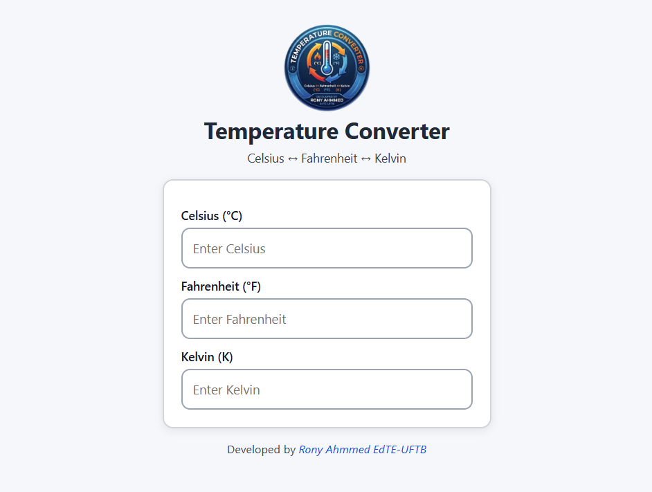

# 🌡 Temperature Converter

A simple and interactive web application to convert temperatures between Celsius, Fahrenheit, and Kelvin.

## 🚀 Features
- Convert Celsius → Fahrenheit → Kelvin
- Convert Fahrenheit → Celsius → Kelvin
- Convert Kelvin → Celsius → Fahrenheit
- Real-time conversion (instant update)
- Clean and responsive UI

## 🛠 Technologies Used
- HTML5
- CSS3
- JavaScript (Vanilla JS)

## 📸 Preview 


## 📂 Project Structure
```/temperature-converter
│── index.html
│── style.css
│── script.js
│── README.md
```

## 📚 What I Learned
- DOM manipulation
- Event handling in JavaScript
- Temperature conversion formulas
- Basic UI design

## 🌐 Live Demo
You can try the live demo of the Temperature Converter [here](https://rony7s.github.io/temperature-converter).

## 👨‍💻 Author
Made by Rony Ahmmed